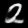
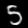

# Generating Synthetic Images Using Few Examples for Supervised Training

## Project Overview
This is the repository for my senior project. While the project is not yet polished and the repo is not tidied up,  the notebooks and slides included provide an overview of the key methods and insights. I will try to update here.
The project is in the **research phase**, focusing on understanding and leveraging modern generative techniques like **diffusion models** and their derivatives.

## Repository Structure

### 1. Presentations
- Contains **slides** summarizing the key topics studied.
- Current focus: **Guided Dİffusion**.

### 2. Jupyter Notebooks
- **Toy Examples**: Simple implementations to understand and experiment with generative techniques.
- Topics covered:
  - Variational Autoencoder (VAE)
  - GANS
  - Basic diffusion model simulations.
  - Classifier and classifier free-guidance
 
### 3. Interesting 
When working on VAE, I created these simple toy manifestations, from [the VAE paper](https://arxiv.org/abs/1312.6114)

